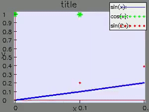
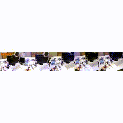
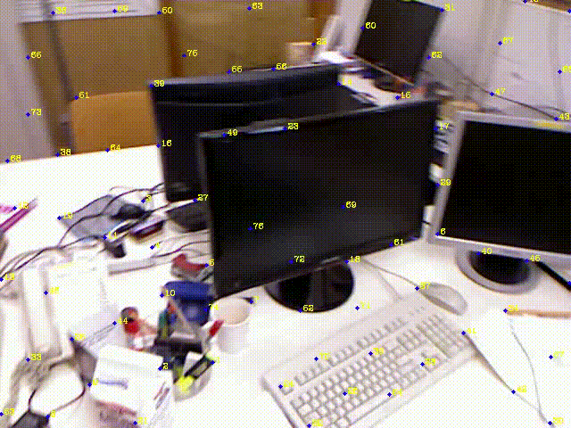
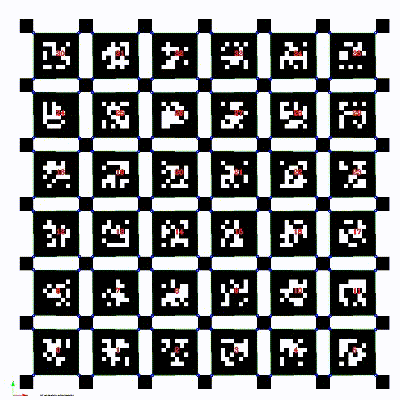
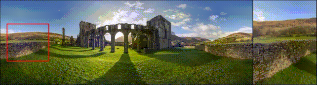
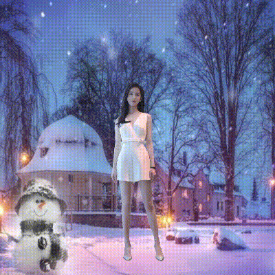
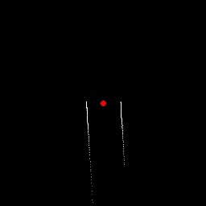
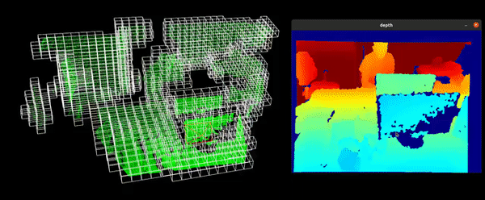

# VIOLA
VIOLA(Vision-Imu-Odometry LibrAry) is a versatile C++ library for vision/robotics system. We try to build it as a common basic library for vision/robotics packages. Someone can easily add part of source files into their project if they only want to use several functions and don't want to import the whole library.

It contains:
- Basic data structure such as: FIFO, fix-length-queue, rater, thread-safe variable, KD-tree, grid-map.
- Basic numeric functions and geometry functions for SLAM.
- Basic 2D SLAM algorithms such as: particle filter, grid mapping, ray casting.
- Basic VSLAM algorithms such as: calibration(mono, stereo, VIO), shape detection(circle, triangle rectangle), lane detection.
- Miscellaneous 'dirty works' for vision/robotics systems such as: file system, yaml, tictoc, data logger, debug draw, profiling. Thus make researcher focus on their algorithms.

This repo is a treasure chest for **SLAM/AR/VIO/Robotics** researchers.

## Prerequisites
- [C++ 11](https://en.wikipedia.org/wiki/C%2B%2B11)
- [Eigen3](http://eigen.tuxfamily.org)
- [OpenCV](https://opencv.org)
- [optional] [Boost](https://www.boost.org/): required by kd-tree and read-write lock.
- [optional] [g2o](https://github.com/RainerKuemmerle/g2o): required by vs_g2o_solver for PnP and graph-slam.
- [optional] [stb](https://github.com/nothings/stb): required by vs_stb_image for image reading/writing without OpenCV.

## What can we do?
- Basic
  - Random Number: generating random number(int/double/array), shuffling, sampling. Similar usage to numpy.random in python.
  - Timer/Tictoc: timer, tictoc, fps calculator, rater.
  - Data Structure: singleton, 2D array, fixed length queue, circular queue, max/min value queue/stack, priority queue, atom buffer, exponential/median/mean filter, data saver, time buffer.
  - Log: a simple logger which can output message to screen, file as well as any user-defined callback.
  - File Operation: ```exists, mkdir, listdir, join, splitext```. Similar usage to os in python.
  - 2D Plot: s simple 2D plot lib implemented by OpenCV, Similar usage to Matlab or matplotlib.pyplot in python.
  - 3D Visualization: a simple 3D visualization lib implemented by ```cv::viz::Viz3D```.
- VSLAM/VIO
  - VIO dataset loader: support EuROC, KITTI, TUM-VIO, UZH-VIO.
  - VIO data recorder: Recorder camera and imu data.
  - Feature Detection and Tracking: detect features in frame and tracking in concecutive frames.
  - Triangulation: Solve feature 3D position with observations from known camera poses.
  - PnPL: Perspective n-Points or Lines to solve camera pose from 3D-2D matches.
- Vision
  - Image Processing: color transformation, alpha blending, histogram matching
  - Object Tracking: 2D boundingbox tracking based on features.
  - Shape Detection: detect special shape such as: circle, triangle, arrow, con-centric shape. 
  - Panorama: convert equirectangular panorama image to perspective local view with camera intrinsic and extrinsic
- SLAM/Robotics
  - Particle Filter: a template particle filter with importance/weighted resampling.
  - 2D/3D Grid Mapping: 2D/3D grid mapping with raycasting
- Wapper for exist open-source library
  - [cmdline](https://github.com/tanakh/cmdline): input argument parsing.
  - [kdtree](): K-dimension tree, for nearest searching.
  - [stb](https://github.com/nothings/stb): image reading/writing.
  - yaml: Yaml file parser based on ```cv::FileStorage```.
  - [json](https://github.com/dropbox/json11): Json file parser.
  - [g2o](https://github.com/RainerKuemmerle/g2o): wrapper of g2o for easily building graph-SLAM or PnP problems
  - [fbxsdk](https://www.autodesk.com/developer-network/platform-technologies/fbx-sdk-2020-2-1): fbx file reading/writing.

## Headers Summary
|Filename|Need Eigen|Need OpenCV|Details|
|--|--|--|--|
|[vs_align.h](./src/viola/vs_align.h)||√|pixel align using direct method in VSLAM|
|[vs_argparse.h](./src/viola/vs_argparse.h)|||A modified version of https://github.com/tanakh/cmdline|
|[vs_basic.h](./src/viola/vs_basic.h)|||macros, numerics utils, vector utils, string utils|
|[vs_calib.h](./src/viola/vs_calib.h)|√|√|mono/stereo calibration data structure, camera-odometry hand-eye calibration.|
|[vs_cam_cap.h](./src/viola/vs_cam_cap.h)||√|camera capture using opencv, capture image with rolling buffer in real-time, auto save video.|
|[vs_color_adjust.h](./src/viola/vs_color_adjust.h)||√|Adjust image color style to reference image style, such as: histogram matching, color statistic matching.|
|[vs_color_filter.h](./src/viola/vs_color_filter.h)||√|label image to mask with specific color such as:red, yellow, white.|
|[viola.h](./src/viola/viola.h)|√|√||
|[vs_cv_convert.h](./src/viola/vs_cv_convert.h)||√|data convertion between Eigen and opencv.|
|[vs_cv_io.h](./src/viola/vs_cv_io.h)||√|file I/O for OpenCV mat|
|[vs_data.h](./src/viola/vs_data.h)|||useful data structure(FIFO, FILO, max heap, circular queue), atom/locked data buffer, sychronized time buffer, median/mean/exponetial filter, asynchronized data saver.|
|[vs_data_recorder.h](./src/viola/vs_data_recorder.h)||√|general data recorder for image (into video or file) and string content (into file), asynchronized.|
|[vs_debug_draw.h](./src/viola/vs_debug_draw.h)||√|draw keypoints, feature tracking, mask, camera pose in 2D image with OpenCV. image hstack/vstack/gridstack.|
|[vs_eigen_io.h](./src/viola/vs_eigen_io.h)|√||file I/O for Eigen dense/sparse matrix.|
|[vs_encrypt.h](./src/viola/vs_encrypt.h)|||string content encrypting/decrypting.|
|[vs_fbx.h](./src/viola/vs_fbx.h)|√||wrapper of fbxsdk for fbx reading/writing.|
|[vs_feature.h](./src/viola/vs_feature.h)||√|detect and track 2D point feature between consecutive frames.|
|[vs_feature_line.h](./src/viola/vs_feature_line.h)||√|detect and track 2D line feature between consecutive frames|
|[vs_g2o_solver.h](./src/viola/vs_g2o_solver.h)|√|√|g2o wrapper for PnP, Graph-SLAM.|
|[vs_geometry2d.h](./src/viola/vs_geometry2d.h)||√|geometry for 2D point, line, rect.|
|[vs_geometry3d.h](./src/viola/vs_geometry3d.h)|√||geometry for 3D transformation and 6 DoF pose.|
|[vs_gridmap.h](./src/viola/vs_gridmap.h)|||2D/3D grid map buffer|
|[vs_improc.h](./src/viola/vs_improc.h)||√|color conversion, region filter, alpha blending, histogram matching|
|[vs_imsaver.h](./src/viola/vs_imsaver.h)||√|save image file in an asynchronous manner|
|[vs_imtrans.h](./src/viola/vs_imtrans.h)||√|universal image transformation for image processing|
|[vs_imu.h](./src/viola/vs_imu.h)|√|√|IMU numerical integration, pre-integration, ZUPT trigger.|
|[vs_json.h](./src/viola/vs_json.h)|||wrapper for json11|
|[vs_kdtree.h](./src/viola/vs_kdtree.h)|||implemention of KD-tree and nereast search.|
|[vs_lane_detect.h](./src/viola/vs_lane_detect.h)||√|detect lane with specific color.|
|[vs_line_match.h](./src/viola/vs_line_match.h)|√|√|2D line segment matching and alignment|
|[vs_logger.h](./src/viola/vs_logger.h)|||a lightweight logger which output message to screen, file as well as user callbacks.|
|[vs_mapping.h](./src/viola/vs_mapping.h)|||2D/3D grid mapping using rolling buffer, local map is used for obstacle avoidance|
|[vs_mesh.h](./src/viola/vs_mesh.h)||√|3D mesh data|
|[vs_os.h](./src/viola/vs_os.h)|||cpu handle, file utils, path utils which is similar to os.path in python.|
|[vs_panorama.h](./src/viola/vs_panorama.h)||√|convert equirectangular panorama image to perspective local view with camera intrinsic and extrinsic.|
|[vs_perf.h](./src/viola/vs_perf.h)|||performance evaluation for algorithms time cost.|
|[vs_pf.h](./src/viola/vs_pf.h)|||a template particle filter with importance/weighted resampling.|
|[vs_plot.h](./src/viola/vs_plot.h)||√|s simple 2D plot lib implemented by OpenCV, Similar usage to Matlab or matplotlib.pyplot in python.|
|[vs_pnp.h](./src/viola/vs_pnp.h)||√|perspective-n-points algorithms, closed form for translation-only pnp, pnl, as well as 4-Dof pnp, pnl.|
|[vs_random.h](./src/viola/vs_random.h)|||random generator and sampling. Similar to numpy.random in python|
|[vs_raycast.h](./src/viola/vs_raycast.h)|||2D/3D line voxel tracersal using Bresenham's algorithm|
|[vs_rot.h](./src/viola/vs_rot.h)|||conversion between quaternion(w, x, y, z), eular(yaw, pitch, roll) and rotation matrix|
|[vs_sfm.h](./src/viola/vs_sfm.h)|√|√|Structure-from-motion in vision initialization|
|[vs_stb_image.h](./src/viola/vs_stb_image.h)||√|Image reading/writing using stb_image api, same use as cv::imread/cv::imwrite.|
|[vs_tag.h](./src/viola/vs_tag.h)||√|detect 2D tags in image, support chessboard, apriltag, ARUCO.|
|[vs_tictoc.h](./src/viola/vs_tictoc.h)|||evaluate the time cost.|
|[vs_tracking.h](./src/viola/vs_tracking.h)||√|2D boundingbox tracking based on point features.|
|[vs_triangulate.h](./src/viola/vs_triangulate.h)|√||two-view/multi-view triangulation|
|[vs_video_saver.h](./src/viola/vs_video_saver.h)||√|save video in an asynchronous manner.|
|[vs_vio_data_loader.h](./src/viola/vs_vio_data_loader.h)|√|√|VIO dataset loader for EuROC, KITTI, TUM-VIO, UZH-VIO as well as inner format.|
|[vs_vio_data_saver.h](./src/viola/vs_vio_data_saver.h)||√|Recorder VIO data in inner format.|
|[vs_vio_type.h](./src/viola/vs_vio_type.h)||√|common data structure in VIO|
|[vs_viz3d.h](./src/viola/vs_viz3d.h)||√|3D visulization based on cv::Viz in an asynchronous manner.|
|[vs_yaml_parser.h](./src/viola/vs_yaml_parser.h)||√|param reader and writer of file in Yaml format, based on opencv.|

## Demos

|2D Plot|Debug Draw|
|--|--|
|||

|Feature Detection and Tracking|Tag Detection|
|--|--|
|||

|Panorama|Color Adjustment|
|--|--|
|||

|2D grid mapping|3D grid mapping|
|--|--|
|||


## How to use?
```
mkdir build
cd build
cmake ..
make -j
sudo make install
```

## License
The source code is released under [GPLv3](http://www.gnu.org/licenses/) license.

This library is not full tested. Please send any feedback or bugreports to Shuyuan Mao \<maoshuyuan123@gmail.com>.

For commercial inquiries, please contact Shuyuan Mao  \<maoshuyuan123@gmail.com>.